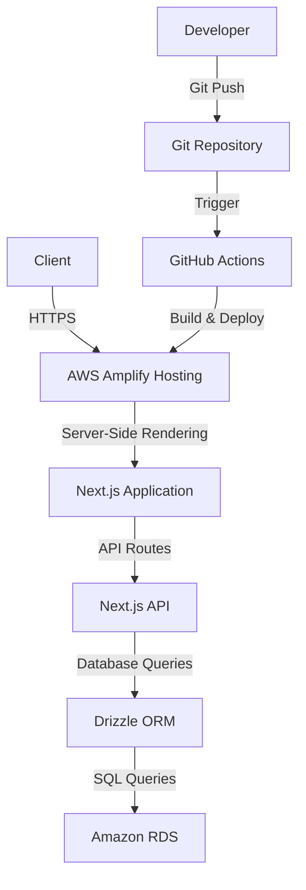

# Overview

このプロジェクトは、AWSとNext.jsを利用した最新のウェブアプリケーションです。システムアーキテクチャは、AWS Amplify HostingとAmazon RDSを活用し、Next.jsとDrizzle ORMを用いてサーバーサイドレンダリングと効率的なデータベース操作を実現します。

# Architecture

# Technology Stack

## Front End

- [Next.js](https://nextjs.org) - React framework for server-side rendering and static site generation
- [NextAuth.js](https://next-auth.js.org) - Authentication for Next.js
- [Tailwind CSS](https://tailwindcss.com) - Utility-first CSS framework

## Back End

- [Amazon RDS](https://aws.amazon.com/rds) - Managed relational database service
- [Amazon Amplify](https://aws.amazon.com/amplify) - Full-stack development platform
- [Drizzle ORM](https://orm.drizzle.team) - TypeScript ORM for SQL databases

## DevOps & CI/CD

- [GitHub Actions](https://github.com/features/actions) - Workflow automation and CI/CD

# Development Roadmap

## 1. Project Setup

- [x] Create new project using create-next-app
- [x] Configure TypeScript, Next.js, Tailwind CSS, NextAuth.js
- [x] Install project dependencies
- [x] Set up .gitignore file

## 2. Database Configuration

- [x] Create AWS account (if not already available)
- [x] Set up PostgreSQL instance on AWS RDS
- [x] Configure security groups and open necessary ports
- [x] Obtain and securely store database connection information
- [x] Test database connection (I got the message "You are connected to database "postgres" as user ~")

## 3. ORM Setup

- [x] Install Drizzle ORM and its dependencies
- [ ] Create a database connection file using Drizzle ORM
- [ ] Configure environment variables for database connection
- [ ] Test the connection to AWS RDS PostgreSQL using Drizzle ORM
- [ ] Define database schema using Drizzle's schema definition syntax
- [ ] Generate migration files based on the schema
- [ ] Run migrations to create tables in the AWS RDS PostgreSQL database

## 4. Authentication Setup

- [x] Configure NextAuth.js
- [x] Set up required authentication providers
- [ ] Configure JWT secret

## 5. API Implementation

- [ ] Implement RESTful API endpoints using Next.js API Routes
- [ ] Define request/response types for API routes
- [ ] Integrate Drizzle ORM for database operations
- [ ] Implement error handling and validation

## 6. Frontend Development

- [ ] Create necessary page components
- [ ] Style components using Tailwind CSS
- [ ] Implement service layer for API calls
- [ ] Set up state management and data fetching (e.g., React Query or SWR)

## 7. AWS Amplify Configuration

- [ ] Create application in AWS Amplify Console
- [ ] Connect GitHub repository
- [ ] Configure build settings and environment variables
- [ ] Verify and customize deployment settings

## 8. CI/CD Pipeline Setup

- [ ] Set up GitHub repository
- [ ] Configure GitHub Actions workflows for CI/CD
- [ ] Set up automatic deployments to AWS Amplify

## 9. Security Measures

- [ ] Implement secure environment variable management
- [ ] Verify HTTPS configuration
- [ ] Set up proper CORS settings
- [ ] Implement authentication and authorization for API routes

## 10. Monitoring and Logging

- [ ] Configure log collection with AWS CloudWatch
- [ ] Set up application performance monitoring

## 11. Testing and Quality Assurance

- [ ] Implement unit tests (using Jest)
- [ ] Create integration tests for API endpoints
- [ ] Set up E2E tests (e.g., Cypress)
- [ ] Configure linter (ESLint) and formatter (Prettier)

## 12. Documentation

- [ ] Create and maintain comprehensive README.md
- [ ] Generate API documentation (consider using Swagger/OpenAPI)
- [ ] Document deployment process

## 13. Final Checks and Deployment

- [ ] Perform thorough testing of all features
- [ ] Conduct performance checks
- [ ] Deploy to production environment
